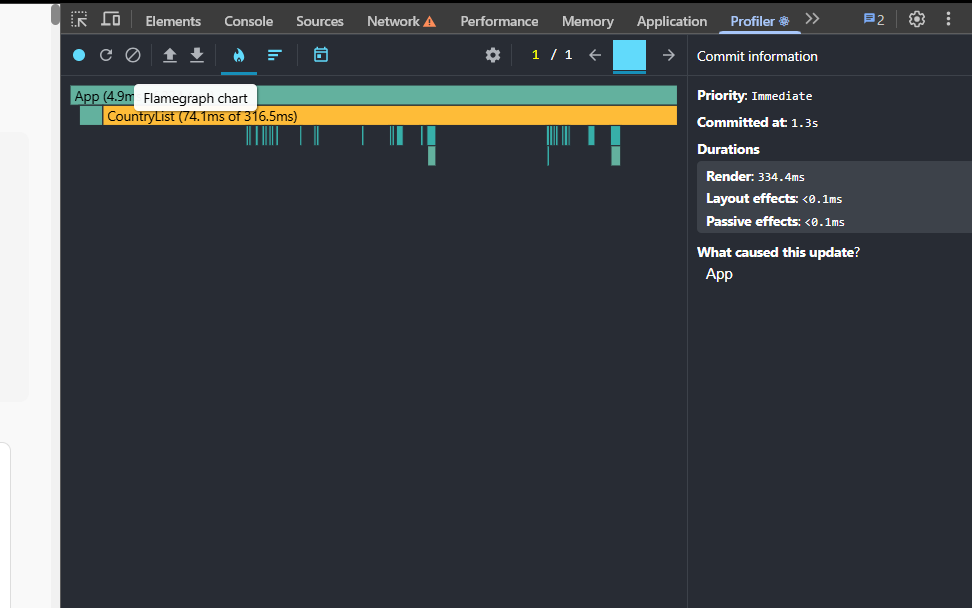
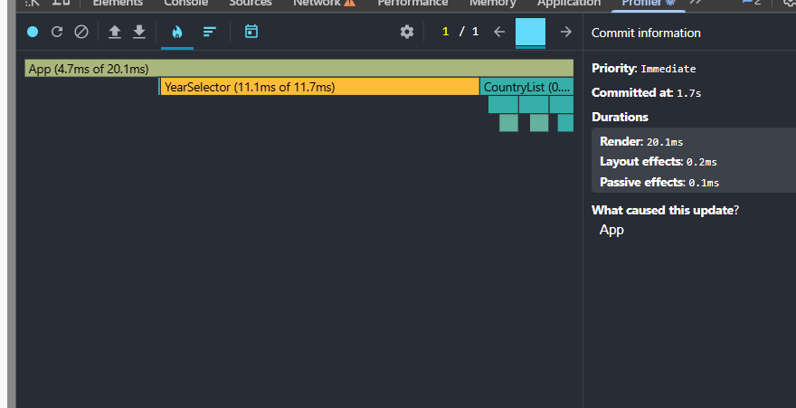
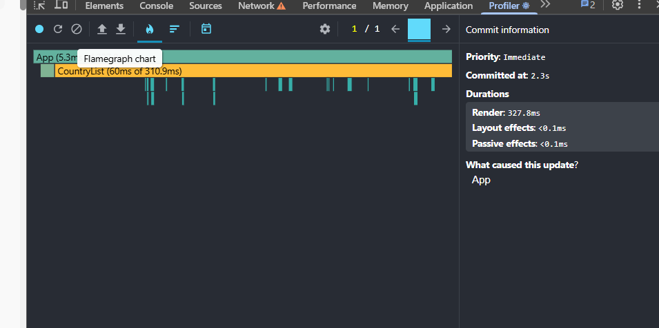
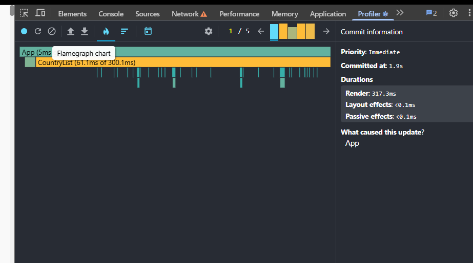

# Performance Optimization Report

## Baseline Measurements

### Interaction A: Sort countries

- **Commit duration**: \1.3\_\_ s
- **Render duration**: \334.4\_\_ ms
- **Screenshot**: 

### Interaction B: Search countries

- **Commit duration**: \1.7\_\_ s
- **Render duration**: \20.1\_\_ ms
- **Screenshot**: 

### Interaction C: Change year

- **Commit duration**: \2.3\_\_ s
- **Render duration**: \327.8\_\_ ms
- **Screenshot**: 

### Interaction D: Toggle column

- **Commit duration**: \1.9\_\_ s
- **Render duration**: \317.3\_\_ ms
- **Screenshot**: 