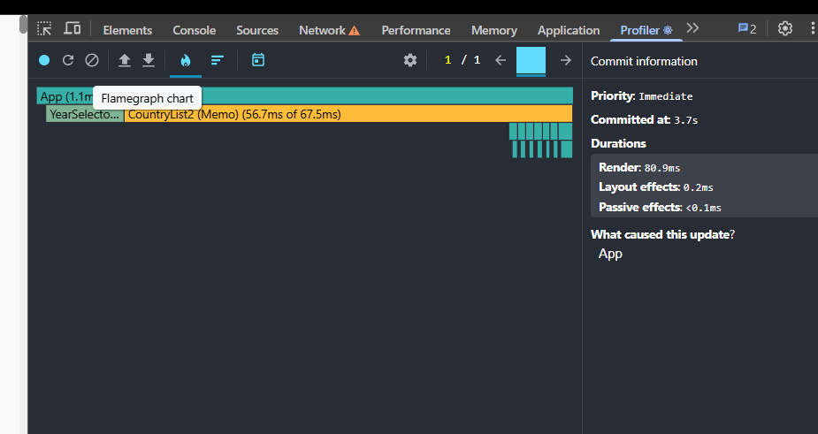
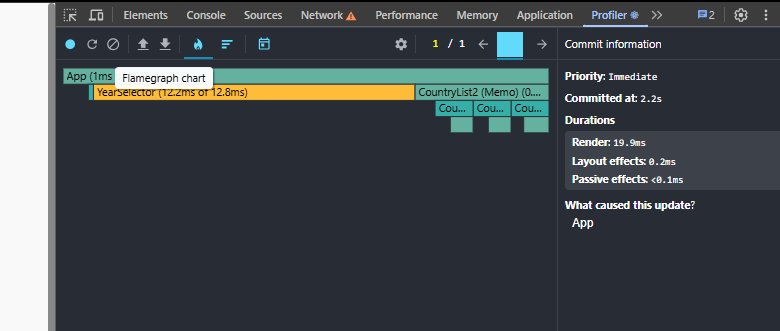
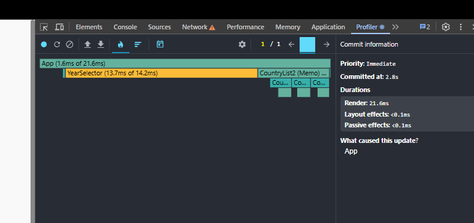
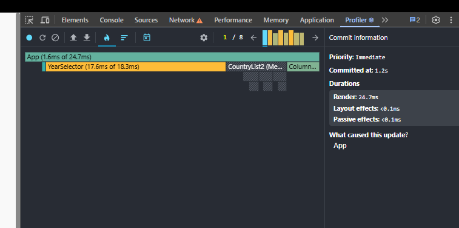

# Performance Optimization Report

## Baseline Measurements

### Interaction A: Sort countries

- **Commit duration**: \1.3\3.7 s
- **Render duration**: \334.4\80.9 ms
- **Screenshot**: 
- **Screenshot**: 

### Interaction B: Search countries

- **Commit duration**: \1.7\2.2 s
- **Render duration**: \20.1\19.9 ms
- **Screenshot**: 
- **Screenshot**: 

### Interaction C: Change year

- **Commit duration**: \2.3\2.8 s
- **Render duration**: \327.8\21.6 ms
- **Screenshot**: 
- **Screenshot**: 

### Interaction D: Toggle column

- **Commit duration**: \1.9\1.2 s
- **Render duration**: \317.3\24.7 ms
- **Screenshot**: 
- **Screenshot**: 

| Interaction      | Baseline (ms) | Optimized (ms) | Improvement |
| ---------------- | ------------- | -------------- | ----------- |
| Sort countries   | 334.4         | 80.9           | 75.8%       |
| Search countries | 20.1          | 19.9           | 1.0%        |
| Change year      | 327.8         | 21.6           | 93.4%       |
| Toggle column    | 317.3         | 24.7           | 92.2%       |
| **Average**      | **249.9**     | **36.8**       | **85.3%**   |